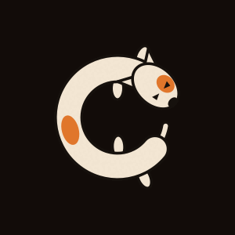
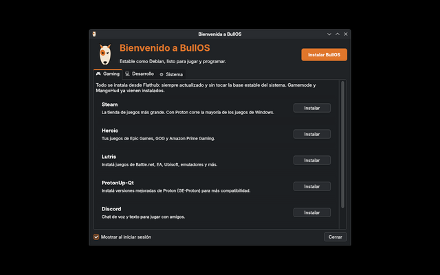
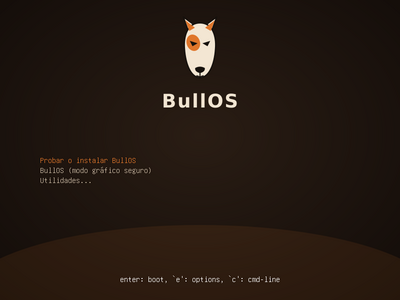

<p align="center">
  
</p>

<h1 align="center">BullOS</h1>

<p align="center">
  <b>Estable como Debian, listo para jugar y programar.</b><br>
  Distribución Linux basada en Debian 13 (trixie) con KDE Plasma 6, pensada para gamers y programadores.
</p>

<p align="center">
  
</p>

<p align="center">
  <a href="https://sourceforge.net/projects/bullos/files/0.1/bullos-amd64.hybrid.iso/download"><b>⬇️ Descargar BullOS 0.1 (ISO, 2.7 GB)</b></a>
</p>

---

## Descargar

| Versión | Archivo | SHA-256 |
|---|---|---|
| 0.1 | [bullos-amd64.hybrid.iso](https://sourceforge.net/projects/bullos/files/0.1/bullos-amd64.hybrid.iso/download) (2.7 GB, amd64) | `c771be69b8f089d655eec274317fac315727fb6b825eb3f354b9ff812f0d56b2` |

Todas las versiones están en [SourceForge](https://sourceforge.net/projects/bullos/files/).
Para verificar la descarga:

```sh
shasum -a 256 bullos-amd64.hybrid.iso    # macOS
sha256sum bullos-amd64.hybrid.iso        # Linux
```

Grabala en un USB con [balenaEtcher](https://etcher.balena.io/) y arrancá la PC desde el USB.
La sesión de prueba abre la Bienvenida con el botón **Instalar BullOS**.

## ¿Por qué BullOS?

Las distros "gamer" rolling release (como CachyOS) son rapidísimas, pero se rompen seguido
y no siempre corren todo lo que necesitás. BullOS toma el camino opuesto:

| | Distros gaming rolling | **BullOS** |
|---|---|---|
| Base | Arch, se actualiza todo siempre | **Debian stable**: casi nunca se rompe |
| Juegos | Mesa y kernel de último momento | Steam y lanzadores por **Flatpak**, que traen su propio Mesa actualizado sin tocar la base |
| Kernel | Propio, optimizado | Kernel firmado de Debian (Secure Boot) + **XanMod** o backports con un clic |
| Programas de otras distros | Solo los de Arch/AUR | **Distrobox**: contenedores de Arch (con AUR) y Ubuntu integrados al menú |
| Programas de Windows | Wine a mano | Proton (Steam) y **Bottles** con un clic |

El nombre viene del **bull terrier**: tozudo, leal y con energía de sobra. Cuando se emociona
gira sobre sí mismo persiguiéndose la cola, y eso es exactamente lo que hace en la pantalla de arranque.

## Qué trae

### 🎨 Aspecto propio
- Look-and-feel de Plasma `org.bullos.desktop`: modo oscuro con acento cobre, íconos Papirus,
  cursor Bibata, fuentes Inter y JetBrains Mono.
- Marca BullOS en todo el recorrido: menú de arranque de la ISO, GRUB, animación de arranque
  (Plymouth), login (SDDM), pantalla de carga de Plasma, fondo, avatar de usuario, instalador
  (Calamares), perfil de Konsole y `fastfetch`.

### ⚡ Rendimiento
Ajustes inspirados en las distros gaming, aplicados sobre una base estable
([`90-bullos.conf`](config/includes.chroot/etc/sysctl.d/90-bullos.conf)):
- **zram** con zstd (swap comprimida en RAM) y **earlyoom** para que el sistema no se congele sin memoria.
- Planificador de disco según el tipo (NVMe, SSD, HDD) y red con **BBR**.
- `vm.max_map_count` alto y límites de archivos amplios, que necesitan Proton y muchos juegos.
- Arranque sin esperar la red y sin indexado de archivos en segundo plano.

### 🎮 Gaming
Vulkan, **Gamemode**, **MangoHud**, reglas para mandos (steam-devices), firmware y microcódigo
incluidos. Desde la Bienvenida: Steam, Heroic (Epic, GOG, Amazon), Lutris, ProtonUp-Qt, Discord,
OBS y el driver de NVIDIA si detecta una placa.

### 💻 Desarrollo
Git, Python y herramientas básicas incluidas. Con un clic: kit completo (gcc, cmake, Node.js,
Docker, Docker Compose), Visual Studio Code y contenedores de Arch o Ubuntu.

### 🐾 Herramientas BullOS

<p align="center">
  
</p>

- **`bullos-welcome`**: la app de bienvenida (PyQt6), con pestañas de Gaming, Desarrollo y Sistema.
  En la sesión de prueba muestra el botón **Instalar BullOS**.
- **`bullos-tools <acción>`**: lo que hay detrás de cada botón, usable desde la terminal:
  `actualizar`, `steam`, `heroic`, `lutris`, `protonup`, `bottles`, `discord`, `obs`, `nvidia`,
  `kernel-backports`, `kernel-xanmod`, `devkit`, `vscode`, `caja-arch`, `caja-ubuntu`.

## Construir la ISO

BullOS se genera con [live-build](https://manpages.debian.org/trixie/live-build/lb_config.1.en.html)
dentro de Docker, así que se puede construir desde macOS, Windows o Linux.

**Requisitos:** Docker Desktop (con 4 GB de RAM o más) y unos 20 GB de disco libre.

```sh
git clone https://github.com/filtrado36-cyber/bullos.git
cd bullos
./build.sh              # genera out/bullos-amd64.hybrid.iso (30-60 minutos)
```

**Probarla:**
- En una máquina virtual (UTM, VirtualBox, GNOME Boxes…) con UEFI, 6 GB de RAM y 30 GB de disco.
- En una PC real: grabá la ISO en un USB con [balenaEtcher](https://etcher.balena.io/) o `dd`.
- Sin abrir nada: `./test-arranque.sh` la arranca en QEMU dentro de Docker y guarda capturas
  de pantalla en `out/capturas/`.

<p align="center">
  
</p>

## Estructura del proyecto

| Ruta | Qué es |
|---|---|
| [`auto/config`](auto/config) | Configuración de live-build: versión de Debian, repositorios, opciones de arranque |
| [`config/package-lists/`](config/package-lists/escritorio.list.chroot) | Paquetes incluidos en la ISO |
| [`config/hooks/normal/9000-branding.hook.chroot`](config/hooks/normal/9000-branding.hook.chroot) | Identidad, tema, Plymouth, Flathub y servicios (corre dentro del sistema durante el build) |
| [`config/includes.chroot/`](config/includes.chroot) | Archivos que se copian tal cual al sistema (ajustes, tema de Plasma, herramientas BullOS) |
| [`config/bootloaders/`](config/bootloaders) | Menús de arranque de la ISO (GRUB y syslinux) |
| [`artwork/logo.svg`](artwork/logo.svg) | El logo. **Todo el arte se genera desde acá** con [`render.sh`](artwork/render.sh) al construir |
| [`artwork/perro-giro.sh`](artwork/perro-giro.sh) | El bull terrier visto desde arriba para la animación de arranque |
| `Dockerfile`, `build.sh`, `docker-entrypoint.sh` | El entorno de construcción |

## Estado

BullOS está en sus comienzos (versión 0.1). Funciona la sesión de prueba, la instalación con
Calamares y el sistema instalado. Ideas y reportes son bienvenidos en *Issues*.

## Licencia

BullOS (scripts, configuración y arte) se distribuye bajo la [GPL-3.0](LICENSE).
BullOS está basado en Debian GNU/Linux, pero no es un producto del Proyecto Debian ni está
respaldado por él. Cada paquete incluido conserva su propia licencia.
